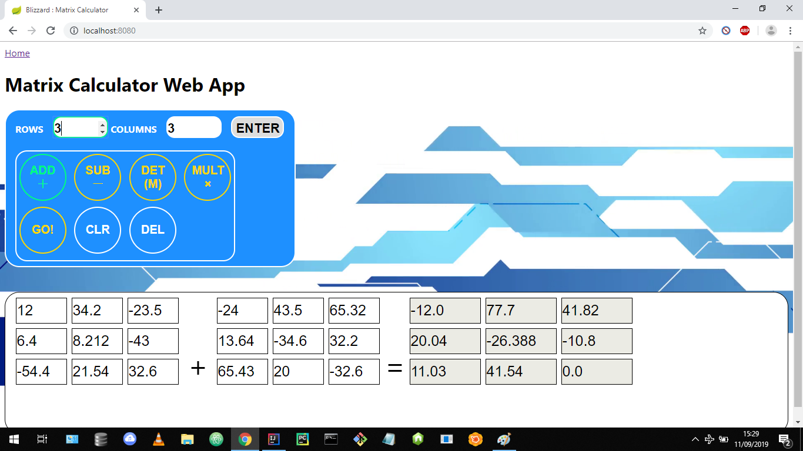

# Matrix Calculator Web Application

## Overview:
This **ongoing** project is a matrix calculator web application created using *Spring Boot*, *HTML*, *JavaScript* and *CSS*. It will perform the following matrix calculations:

- *ADDITION*
- *SUBTRACTION*
- *MULTIPLICATION*
- *DETERMINANT*
- *SCALAR MULTIPLICATION (To be implemented)*

User submitted values for the matrices are sent to the server, which calculates the result and sends the result back to the client to be displayed.

**TODO**:
- Scalar multiplication implementation
- Further unit testing
- Integration testing
- Optimise matrix display
- Drop down navigation bar
- Documentation of JavaScript code
- Deployment
